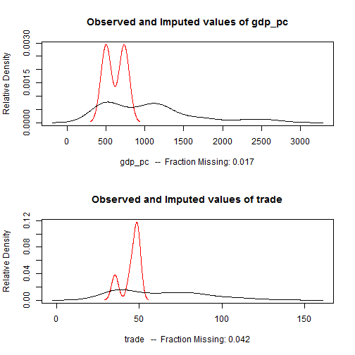

% Strategies for
  Handling Missing Data
% Stephen Haptonstahl
  Berico Technologies
% 2012/08/30

<!-- Compile with: pandoc -i -s -S -toc --latexmathml -t slidy -o HandlingMissingData.html HandlingMissingData.md -->

# The Problem

## Data, in theory

  Right     Left     Center     Default
-------     ------ ----------   -------
     12     12        12            12
    123     123       123          123
      1     1          1             1

Table:  Made-up data

## Data, in practice

  Right     Left     Center     Default
-------     ------ ----------   -------
     12     12        12         &nbsp;
 &nbsp;     123       123          123
      1     1         &nbsp;         1

Table:  Made-up data

## Who cares?

* Best case: throwing away data
* Same as loss of efficiency
* Less certainty (statistical significance)
* Some patterns will be completely missed

## Today's talk

<!-- * [The Problem](#The-Problem) -->

* The Problem
* Problems in Handling Missing Data
* Naive Imputation
* Home-Rolled Imputation
* Pre-sliced solutions
    * Small data sets
    * Large data sets
    * Real-time
* Modeling Nonignorable Missingness

# Problems in Handling Missing Data

## (The Evil that is) Row Deletion

* bullet

## What is imputation?

Imputation

:    Filling in missing data with guesses, good or bad, for what would have been observed.

## When is imputation bad

* Missingness process not ignorable
* Missingness depends on unobserved data
* Get into MCAR, MAR, Rubin

> If only we knew what was there.  Then we would be able to make a good guess at what was there.

# Naive Imputation

## Mean, Median, Mode

* Be specific on what kinds of variables each can summarize (categorical, ordinal, continuous)

## Mean, Median, Mode (continued)

Example table with missing values

## Mean, Median, Mode (continued)

Example table imputed with mean, median, and mode

## Mean, Median, Mode (continued)

* Pros
    * Fast
    * Principled
    * Better than throwing away data
    * Tends to work
* Cons
    * We can do better
    * "Making up data" makes us more certain than we should be

# Home-Rolled Imputation

## Imputation Via Regression

1. Identify a cell <tt>X[i,j]</tt> to impute.
2. Find all rows `prediction.rows` that:
    1. have an observed value for column <tt>j</tt>
    2. have observed values for all other columns <tt>obs.cols</tt> that row <tt>i</tt> has
3. Using those rows: <tt>reg <- lm(X[prediction.rows,j] ~ X[prediction.rows,obs.cols])</tt>
4. Fill with <tt>predict(reg, names(X)[obs.cols]=X[i,obs.cols])</tt>

## Imputation with Regression Example

Data set with missing continuous values

## Imputation with Regression Example

Same data set with missing continuous values filled via linear regression.
Note that the values filled in are not all the same.

## Type of Regression Varies by Variable Type

Continuous

:    Linear regression with <tt>lm()</tt>

Ordinal

:    Ordered logit/probit regression with <tt>MASS::polr</tt>

Count

:    Poisson regression with <tt>glm(..., family=poisson(link = "log"))</tt>

Categorical

:    Multinomial logit with <tt>nnet::multinom</tt>

## Safety First!

* Look out for having too little data to estimate (default to mean/median/mode?)
* Still have problem that "Making up data" makes us more certain than we should be

# Existing Tools

## Small Data Sets

<tt>Amelia</tt>, <tt>mi</tt> work differently from home-rolled solutions

Multiple Imputation

1. Generate $m$ copies of the data set, each with **different** imputed values.
2. Perform the desired analysis on each imputed data set to get the quantity of interest $q$.
3. Aggregate the results:
    1. If $m=5$ or so
        * Point-estimates: <tt>mean(q)</tt>
        * SEs: fairly simple formula
          $$SE(q)=\sqrt{\underbrace{\frac{1}{m}\sum_{j=1}^m SE(q_j)^2}_{within} + \underbrace{\frac{1}{m-1}\sum_{j=1}^m(q_j-\bar{q})^2}_{between}$$
    2. If $m$ large
        * Treat as simulation result
        * <tt>mean</tt> and <tt>sd</tt>
4. Check distribution of observed versus imputed values (<tt>plot</tt>, <tt>ks.test</tt>)

## Amelia Example


```r
library(Amelia)
```

```
## Loading required package: foreign
```

```
## ## ## Amelia II: Multiple Imputation ## (Version 1.6.3, built: 2012-06-21)
## ## Copyright (C) 2005-2012 James Honaker, Gary King and Matthew Blackwell
## ## Refer to http://gking.harvard.edu/amelia/ for more information ##
```

```r
data(africa)
a.out <- amelia(x = africa, cs = "country", ts = "year", logs = "gdp_pc")
```

```
## -- Imputation 1 --
## 
##  1  2 
## 
## -- Imputation 2 --
## 
##  1  2  3 
## 
## -- Imputation 3 --
## 
##  1  2 
## 
## -- Imputation 4 --
## 
##  1  2  3 
## 
## -- Imputation 5 --
## 
##  1  2  3 
## 
```

```r
summary(a.out)
```

```
## 
## Amelia output with 5 imputed datasets.
## Return code:  1 
## Message:  Normal EM convergence. 
## 
## Chain Lengths:
## --------------
## Imputation 1:  2
## Imputation 2:  3
## Imputation 3:  2
## Imputation 4:  3
## Imputation 5:  3
## 
## Rows after Listwise Deletion:  115 
## Rows after Imputation:  120 
## Patterns of missingness in the data:  3 
## 
## Fraction Missing for original variables: 
## -----------------------------------------
## 
##            Fraction Missing
## year                0.00000
## country             0.00000
## gdp_pc              0.01667
## infl                0.00000
## trade               0.04167
## civlib              0.00000
## population          0.00000
## 
```

```r
plot(a.out)
```

 


## That's hard. What have we gained or lost?

* Correct reporting of uncertainty (SEs)
* Actually, it's easier than rolling your own
    * Smart about pathologies
    * Smart about variable types
    * Code is shorter if you are implementing in <tt>R</tt>
    * Very fast on reasonably sized data sets
* If you are **not** implementing in <tt>R</tt>, you have a lot more work
    * Reading the papers, implementing your own version
    * Quite do-able, not for faint at heart
* Not scalable

## Large Data Sets: Bayes

Bayesian data augmentation

:    When using Bayes to estimate a model, put a prior on the *data* and the algorithm will give draws from the posterior distribution of the missing values

* Slow
* Convergence can be tricky
* Expertise required for custom samplers
* Libraries for implementing custom solutions: <tt>rcppbugs</tt> in R, others for C++, Python, etc.

## Bayes (continued)

Example: Using Bayes for IRT on network links to generate DILS (data-informed link strength)

 linkid   net1   net2   net3   ...   netk 
-------- ------ ------ ------ ----- ------
  1       1      0      0      ...   1
  2       0      0      1      ...   0
  3       1      NA     1      ...   1
  4       1      0      NA     ...   0
  5       NA     0      0      ...   1

becomes...

## Bayes (continued)

Example: Using Bayes for IRT on network links to generate DILS (data-informed link strength)

 linkid  dils
-------- -----
  1       .12
  2       .01
  3       .34
  4       .08
  5       .03

## Large Data Sets: Random Forest Classifier

* <tt>missForest</tt>

## Real-Time: FastImputation

* Same model as Amelia
* Learns (slowly) using lots of (big?) data
* 

8. Real-time imputation: FastImputation (and anything else if I can find
anything)
9. Modeling non-ignorable missingness processes

## Links

* This presentation and code: https://github.com/shaptonstahl/MissingData_2012-08
* <tt>Amelia</tt>: http://gking.harvard.edu/amelia
* <tt>mi</tt>: http://cran.r-project.org/web/packages/mi
* Great ref on missing data, imputation: http://gking.harvard.edu/files/evil.pdf
* Great place to work: http://www.bericotechnologies.com
